# Suricata IDS/IPS Setup on pfSense

A comprehensive, step-by-step guide to installing and configuring **Suricata** as an Intrusion Detection System (IDS) and Intrusion Prevention System (IPS) on **pfSense**. This lab demonstrates how to detect and block network threats — including Nmap scans — from an external Kali Linux machine targeting an internal Ubuntu machine.

---

## Table of Contents

- [What is pfSense?](#what-is-pfsense)
- [What is Suricata?](#what-is-suricata)
- [What is an IDS vs IPS?](#what-is-an-ids-vs-ips)
- [Lab Topology](#lab-topology)
- [Prerequisites](#prerequisites)
- [Installation](#installation)
- [Configuration](#configuration)
- [Testing the IDS/IPS](#testing-the-idsips)
- [Results](#results)
- [Summary](#summary)

---

## What is pfSense?

**pfSense** is a free, open-source firewall and router software based on FreeBSD. It is deployed at the network perimeter — the boundary between your internal (trusted) network and the external (untrusted) network such as the internet. pfSense controls all traffic entering and leaving your network, and it can be extended with packages like Suricata to add advanced security capabilities such as intrusion detection and prevention.

Think of pfSense as the security gate of your network. Everything that comes in or goes out must pass through it.

---

## What is Suricata?

**Suricata** is a high-performance, open-source network security engine developed by the Open Information Security Foundation (OISF). It can function as:

- An **Intrusion Detection System (IDS)** — passively monitors network traffic and generates alerts when suspicious activity is detected, without blocking anything.
- An **Intrusion Prevention System (IPS)** — actively monitors and **blocks** malicious traffic in real time before it reaches its destination.
- A **Network Security Monitor (NSM)** — logs all network activity for forensic analysis.

Suricata uses **signature-based detection**, meaning it compares network traffic against a database of known attack patterns (rules). When traffic matches a rule, Suricata either alerts or blocks depending on how it is configured.

---

## What is an IDS vs IPS?

| Feature | IDS (Intrusion Detection System) | IPS (Intrusion Prevention System) |
|--------|-----------------------------------|------------------------------------|
| Role | Monitors and alerts | Monitors, alerts, and **blocks** |
| Action on threat | Logs the event | Logs the event + drops/blocks the traffic |
| Placement | Out-of-band (passively watches traffic) | Inline (sits in the traffic path) |
| Risk | Cannot stop attacks on its own | Can accidentally block legitimate traffic (false positives) |

In this lab, Suricata is configured as **both** — it detects threats (IDS) and automatically blocks the offending IP address (IPS).

---

## Lab Topology

```
[ Kali Linux ]  ←→  [ pfSense WAN ] ←→ [ pfSense LAN ] ←→ [ Ubuntu ]
  External                Firewall                           Internal
  Attacker             (Suricata running)                    Target
  192.168.127.130       192.168.47.10                      192.168.47.128
```

- **Kali Linux** is on the **external/WAN** network — this simulates an attacker on the internet.
- **Ubuntu** is on the **internal/LAN** network — this is the machine being protected.
- **pfSense** sits in between, with Suricata inspecting all traffic passing through both the WAN and LAN interfaces.

---

## Prerequisites

- pfSense firewall (running as a VM or physical device)
- Kali Linux machine on an **external** network segment
- Ubuntu machine on an **internal/LAN** network segment
- Internet access from pfSense to download rule sets

---

## Installation

### Step 1 — Install Suricata via Package Manager

Navigate to **System → Package Manager** in the pfSense web UI.

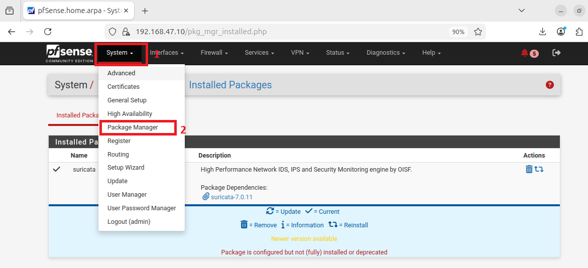

**What is happening here?**
pfSense has a built-in package manager that allows you to install additional software directly from the web interface without needing to use the command line. Suricata is one of the available packages. When you install it, pfSense downloads and sets up Suricata automatically, integrating it into the firewall's services and web UI. Without this step, pfSense would only perform basic firewall filtering (blocking/allowing based on rules) but would have no ability to inspect the **content** of network traffic for attack patterns.

### Step 2 — Access the Suricata Service

After installation, go to **Services → Suricata**.

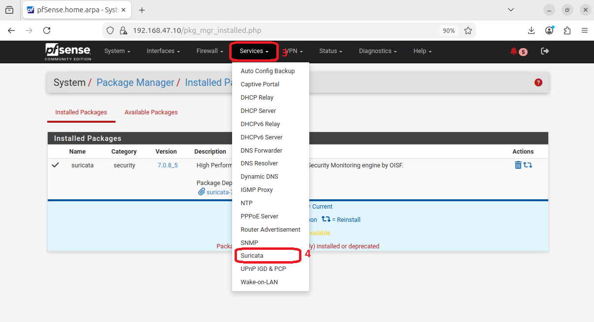

**What is happening here?**
Once installed, Suricata appears as a service under the **Services** menu. This is your central control panel for everything Suricata-related — adding interfaces to monitor, downloading rules, viewing alerts, managing blocked hosts, and reviewing logs. At this point Suricata is installed but not yet active because no interfaces have been configured yet.

---

## Configuration

### Step 3 — Add the WAN Interface

On the **Interfaces** tab, click **+ Add** to create a new interface instance.

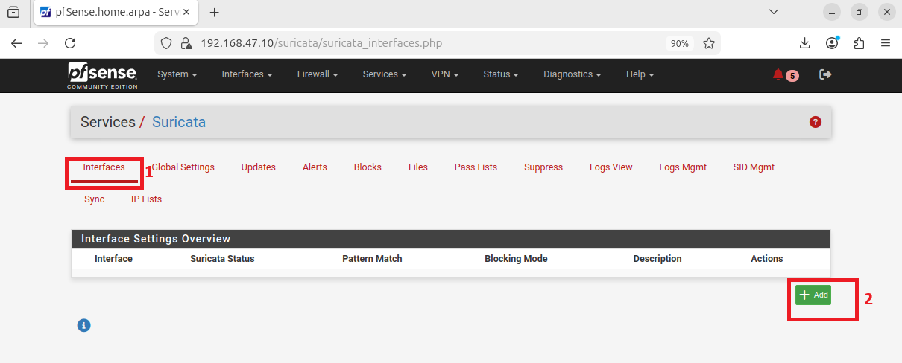

Enable Suricata inspection and select **WAN (em1)** as the interface.


**What is happening here?**
Suricata needs to be told **which network interface to monitor**. A network interface is the connection point between the firewall and a network — in this case, `em1` is the WAN (external) interface that connects pfSense to the outside world.

By adding the WAN interface, you are telling Suricata to inspect all traffic arriving from the external network before it enters your internal network. This is the most critical monitoring point because it catches threats coming from outside before they can reach internal machines.

The `em1` refers to the physical or virtual network adapter name assigned by the operating system. Your interface name may differ depending on your hardware or virtualization platform.

### Step 4 — Configure Alert and Block Settings (WAN)

Scroll down to the **Alert and Block Settings** section:

1. Check **Block Offenders** to automatically block hosts that generate a Suricata alert
2. Set **IPS Mode** to `Legacy Mode`
3. Set **Which IP to Block** to `SRC`

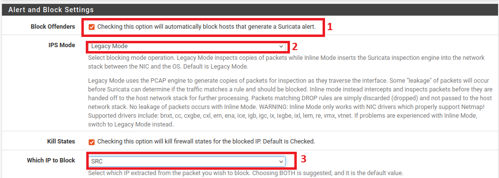

Save the configuration.

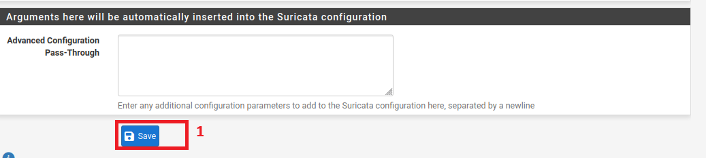

**What is happening here?**

- **Block Offenders:** This is what turns Suricata from a passive IDS into an active IPS. When enabled, any IP address that triggers a Suricata alert is automatically added to a block list and prevented from communicating with your network. Without this, Suricata would only log and alert — the attack would still reach its target.

- **IPS Mode — Legacy Mode:** There are two ways Suricata can intercept traffic:
  - **Legacy Mode** uses the PCAP engine to make copies of packets as they pass through the interface and inspects those copies. Because it is inspecting copies (not the original packets), some traffic may "leak" through before Suricata can block it. It is compatible with all network drivers.
  - **Inline Mode** places Suricata directly in the traffic path between the NIC and the OS, meaning packets are inspected before they are processed. No leakage occurs, but it requires specific network drivers (bnxt, cc, em, ena, igb, ix, etc.). Inline Mode is more secure but has stricter hardware requirements.
  
  Legacy Mode is chosen here because it is the safest and most compatible option for a lab environment.

- **Which IP to Block — SRC:** When a threat is detected, Suricata needs to know which IP address to block. The options are:
  - **SRC (Source):** Block the IP address that sent the malicious traffic (the attacker). This is the most common choice.
  - **DST (Destination):** Block the IP that received it (your own machine — not useful).
  - **BOTH:** Block both source and destination.
  
  Choosing `SRC` means the attacker's IP gets blocked, preventing any further communication from that address.

### Step 5 — Add the LAN Interface

Back on the **Interfaces** tab, click **+ Add** again to add the LAN interface.

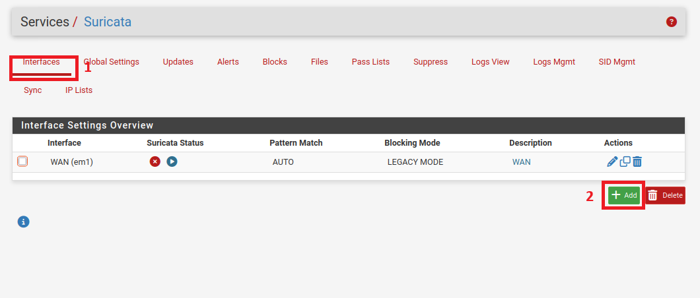


Enable Suricata inspection and select **LAN (em0)** as the interface.

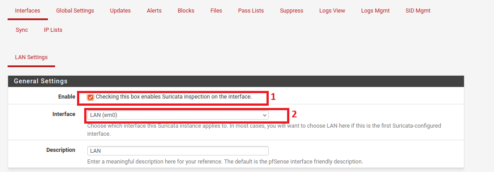

**What is happening here?**
In addition to monitoring the WAN (external) interface, it is important to also monitor the **LAN (internal)** interface. This provides a second layer of protection and serves a different but equally important purpose:

- It can detect threats that originate **from inside** the network — for example, a compromised internal machine that is trying to communicate with a command-and-control server or attack other internal machines.
- It catches any traffic that may have slipped through the WAN inspection.
- It monitors **east-west traffic** (internal machine to internal machine), not just north-south (external to internal).

`em0` is the LAN network adapter name. Monitoring both WAN and LAN gives you full visibility of all traffic entering, leaving, and moving within your network.

### Step 6 — Configure Alert and Block Settings (LAN)

Apply the same blocking configuration for the LAN interface:

1. **Block Offenders** — checked
2. **IPS Mode** — `Legacy Mode`
3. **Which IP to Block** — `SRC`

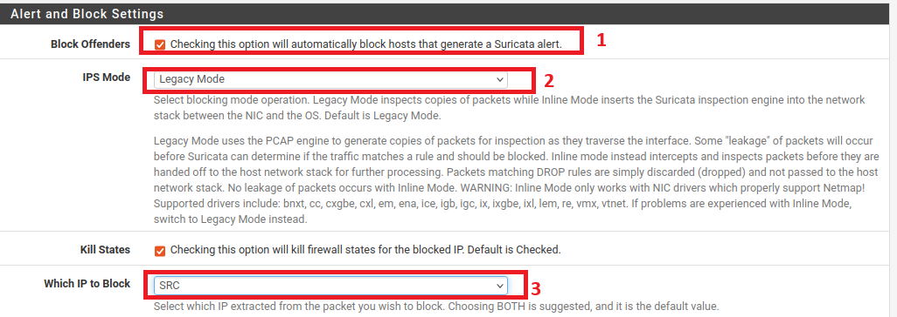

**What is happening here?**
The same IPS settings applied to the WAN interface are now applied to the LAN interface. This ensures that if a threat is detected on internal traffic — such as a compromised device on the LAN trying to attack other internal machines — the source of that threat is also automatically blocked. Consistent settings across both interfaces ensure there are no gaps in protection.

### Step 7 — Configure Global Settings (Rule Sets)

Go to **Global Settings** and select the rule sets to download:

- ✅ **ETOpen Emerging Threats rules** — free open-source Suricata rules
- ✅ **Snort GPLv2 Community rules** — Talos-certified, distributed free of charge

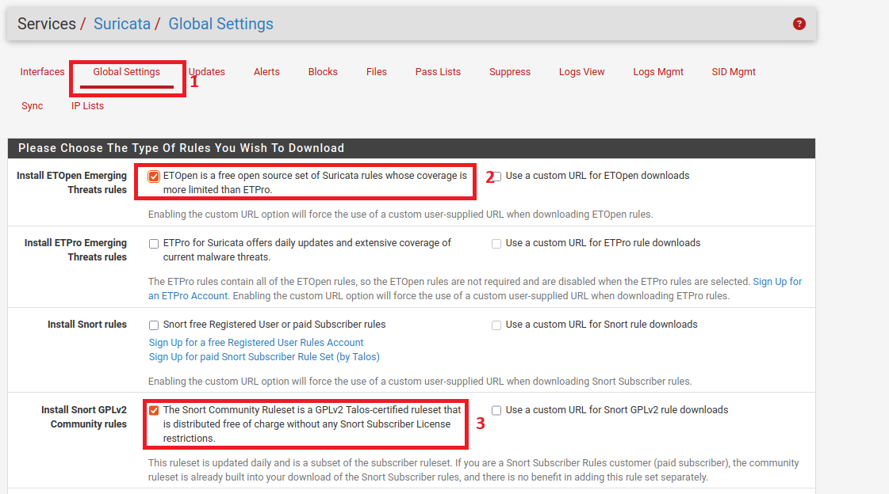

**What is happening here?**
Suricata by itself does not know what is malicious and what is normal traffic. It relies entirely on **rules** (also called signatures) to identify threats. Rules are essentially patterns that describe known attacks — for example, a rule might say "if an ICMP packet has this specific unusual code, it is suspicious."

Rule sets are maintained and updated by security organizations. The two selected here are:

- **ETOpen (Emerging Threats Open):** A free, community-maintained rule set provided by Proofpoint. It covers a wide range of threats including malware, exploits, scanning activity, and botnets. It is updated frequently as new threats emerge. The "Open" version is free; the "Pro" version has more coverage but requires a paid subscription.

- **Snort GPLv2 Community Rules:** A rule set maintained by Cisco Talos, one of the largest threat intelligence teams in the world. It is a subset of the full Snort subscriber rule set, distributed free of charge under the GPLv2 license. It provides additional coverage on top of the ETOpen rules.

Together, these two rule sets give Suricata a broad and regularly updated library of attack signatures to detect threats against your network.

### Step 8 — Set Remove Blocked Hosts Interval

Still under **Global Settings**, configure how long blocked hosts remain blocked. **15 minutes** is set here.

> ⚠️ This setting only applies in **Legacy Mode**. It is ignored in Inline IPS Mode.


**What is happening here?**
When Suricata blocks an IP address, it does not block it forever by default. The **Remove Blocked Hosts Interval** defines how long a blocked IP stays on the block list before being automatically removed.

- **15 minutes** means a blocked IP will be unblocked after 15 minutes and can attempt to connect again.
- **1 hour** is the recommended setting for most environments as it gives enough time to prevent an ongoing attack without permanently blocking IPs that might be legitimate (e.g., dynamic IP addresses that could be reassigned to a different user).
- In a production environment, you might want a longer interval or manual review before unblocking.

This setting is only relevant in **Legacy Mode** because in Inline IPS Mode, blocking is handled differently at the packet level.

Save the settings after configuring this.

### Step 9 — Update Rule Sets

Go to the **Updates** tab and click **Update** to download the latest rule signatures.

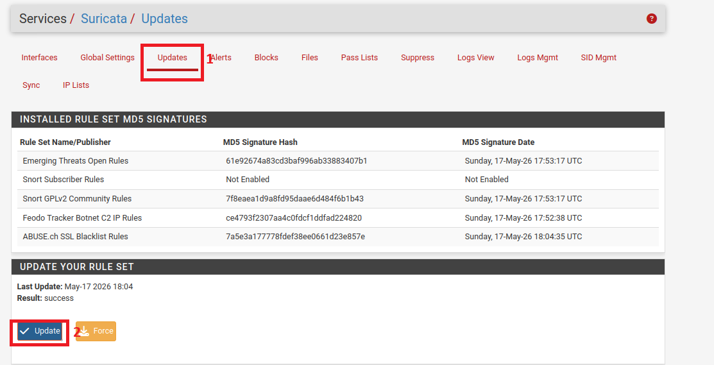

**What is happening here?**
This step downloads the actual rule files from the internet based on the rule sets selected in Global Settings. Suricata cannot detect any threats until the rules are downloaded. The **Updates** tab shows:

- **Installed Rule Set MD5 Signatures:** A fingerprint (hash) of each downloaded rule file. The MD5 hash is used to verify that the file downloaded correctly and has not been tampered with. If the hash changes on the next update, it means new rules have been added or existing ones modified.
- **Last Update timestamp and Result:** Confirms the last time rules were downloaded and whether it was successful.
- **Update button:** Checks for newer versions of the rules and downloads them if available.
- **Force button:** Forces a re-download of all rules even if they haven't changed.

It is important to keep rules updated regularly (daily or weekly) because new attack techniques are discovered constantly and rule sets are updated to detect them.

---

## Testing the IDS/IPS

### Step 10 — Check Alerts Baseline

Navigate to **Alerts** to confirm no alerts exist before running the test.

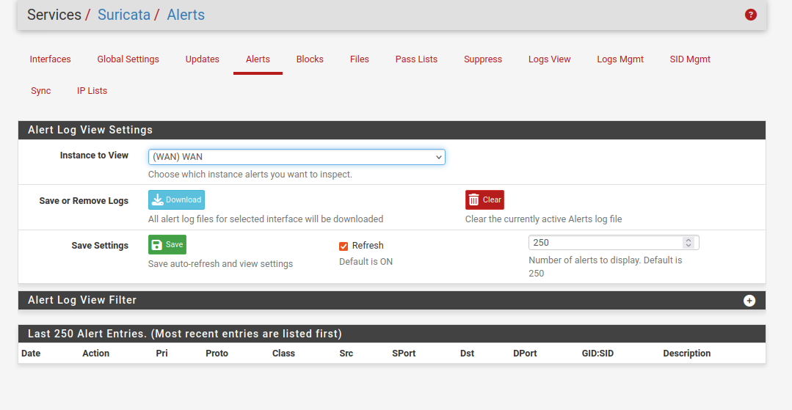

**What is happening here?**
Before running any test, it is good practice to confirm the alerts log is clean — meaning no alerts have been triggered yet. This gives you a clean baseline so that when you run the Nmap scan, any new alerts that appear can be definitively attributed to your test. The **Alerts** tab shows a live log of all events detected by Suricata, including the date, action taken, protocol, source IP, destination IP, the rule that fired, and a description of the threat.

### Step 11 — Run Nmap Scan from Kali Linux

From the Kali machine (external network), run an aggressive Nmap scan targeting the Ubuntu machine (internal network):

```bash
nmap -A -T4 -Pn 192.168.47.128
```

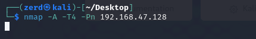

**What is happening here?**
**Nmap** (Network Mapper) is a widely used open-source tool for network discovery and security auditing. Attackers commonly use it to scan a target network and discover open ports, running services, operating system versions, and potential vulnerabilities before launching an attack.

The flags used in this command mean:

| Flag | Meaning |
|------|---------|
| `-A` | Aggressive scan — enables OS detection, version detection, script scanning, and traceroute all at once |
| `-T4` | Timing template 4 (Aggressive) — speeds up the scan, sending packets faster than normal. This makes the scan more detectable by IDS systems |
| `-Pn` | Skip host discovery (ping) — treats the target as online even if it doesn't respond to ping. Useful when ICMP is blocked |
| `192.168.47.128` | The IP address of the Ubuntu target machine on the internal network |

This scan generates a significant amount of unusual network traffic — rapid port probing, OS fingerprinting packets, and ICMP probes — all of which are patterns that Suricata's rules are designed to detect.

---

## Results

### IDS Detection — Alerts Generated

After the Nmap scan, Suricata immediately generated multiple alerts on the **WAN** interface. The alerts show:

- **Source IP:** `192.168.127.130` (Kali — external attacker)
- **Destination IP:** `192.168.47.128` (Ubuntu — internal target)
- **Protocol:** ICMP
- **Rule triggered:** `1:2200025` — *SURICATA ICMPv4 unknown code*

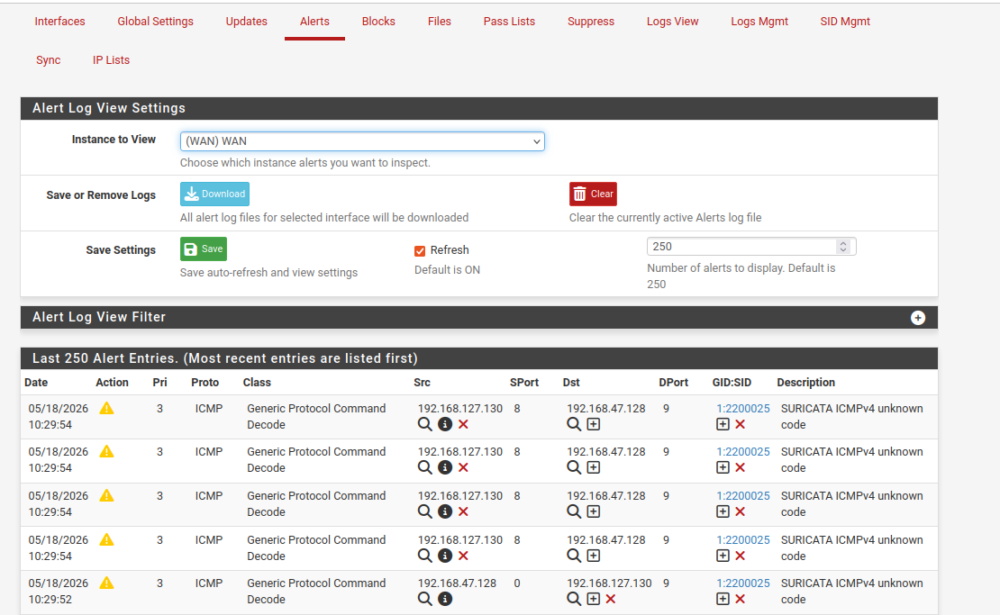

**What is happening here?**
The moment the Nmap scan began sending packets, Suricata's rules matched the traffic patterns and generated alerts. Each row in the alerts table represents a single detection event. The columns tell you:

- **Date:** Exact timestamp of when the suspicious packet was detected
- **Action:** The warning icon (⚠️) indicates an alert was raised
- **Pri (Priority):** Priority 3 means medium severity. Priority 1 is the most critical
- **Proto:** The network protocol involved — ICMP in this case (used by Nmap for host discovery)
- **Class:** The category of the threat — "Generic Protocol Command Decode" means the packet violated expected protocol behavior
- **Src / Dst:** Source and destination IP addresses
- **SPort / DPort:** Source and destination port numbers
- **GID:SID:** The unique identifier of the rule that fired. `1:2200025` means Group ID 1, Signature ID 2200025 — this is a Suricata built-in rule for detecting malformed ICMP packets
- **Description:** Human-readable description of what was detected

The fact that multiple alerts fired in rapid succession (all at 10:29:54) shows the aggressive nature of the Nmap `-T4` scan, which sends many packets very quickly.

### IPS Blocking — Host Blocked in Logs

The **IPS** also blocked the source IP, preventing further access. The `block.log` in **Logs View** confirms the block action:

```
05/18/2026-10:29:52.499506  [Block Src] [**] [1:2200025:2] SURICATA ICMPv4 unknown code [**] [Classification: Generic Protocol Command Decode] [Priority: 3]
```

The blocked host is prevented from reaching the system again until the block interval expires or an administrator manually allows the IP.


**What is happening here?**
The **Logs View** shows the raw Suricata log file, specifically the `block.log`, which records every blocking action taken. Breaking down the log entry:

| Part | Meaning |
|------|---------|
| `05/18/2026-10:29:52.499506` | Exact date and time of the block event (including microseconds) |
| `[Block Src]` | Confirms the **source IP** was blocked (matching our "Which IP to Block = SRC" setting) |
| `[1:2200025:2]` | Rule that triggered the block — GID:SID:Revision |
| `SURICATA ICMPv4 unknown code` | The specific rule description — an ICMP packet with an unknown/invalid code field was detected |
| `Generic Protocol Command Decode` | The classification/category of the threat |
| `Priority: 3` | Medium severity level |

This confirms that Suricata not only **detected** the Nmap scan (IDS function) but also **blocked** the attacker's IP address (IPS function), preventing any further packets from that IP from reaching the internal network. The Kali machine at `192.168.127.130` is now unable to communicate with the Ubuntu machine at `192.168.47.128` until the block interval (15 minutes) expires or an administrator manually removes it from the block list.

---

## Summary

| Component | Role |
|-----------|------|
| pfSense + Suricata | Firewall with integrated IDS/IPS |
| WAN Interface (em1) | Monitors all inbound traffic from the external network |
| LAN Interface (em0) | Monitors all internal network traffic |
| ETOpen Emerging Threats | Free community rule set for broad threat detection |
| Snort GPLv2 Community Rules | Talos-certified free rule set for additional coverage |
| Legacy Mode (IPS) | Blocks offending source IPs using PCAP-based inspection |
| Remove Blocked Hosts Interval | Automatically unblocks IPs after a set time (15 mins here) |
| Kali Linux (`192.168.127.130`) | Attacker machine on the external/WAN network |
| Ubuntu (`192.168.47.128`) | Target machine on the internal/LAN network |

### Key Takeaways

- **IDS alone is not enough** — it detects threats but does not stop them. Enabling IPS mode (Block Offenders) is essential to actively protect your network.
- **Rule sets are the brain of Suricata** — without up-to-date rules, Suricata cannot detect modern threats. Regular updates are critical.
- **Monitoring both WAN and LAN** gives complete visibility — WAN catches external threats, LAN catches internal ones.
- **Legacy Mode vs Inline Mode** — Legacy is compatible with all hardware but has minor leakage risk. Inline is more secure but requires specific NIC drivers.
- **Aggressive Nmap scans are easily detected** — the `-T4` flag and ICMP probes are well-known attack indicators that any properly configured IDS will catch immediately.

Suricata on pfSense provides a powerful, free, and enterprise-grade solution for network intrusion detection and prevention in both home lab and production environments.
